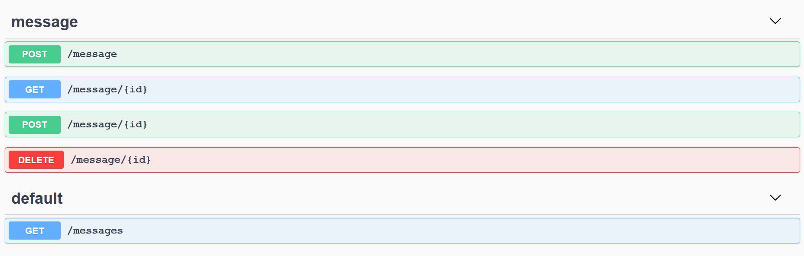
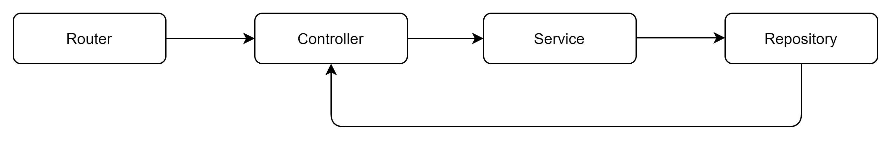

# HTTP Server

- [HTTP Server](#http-server)
    * [Getting started](#getting-started)
        + [Running using Makefile](#running-using-makefile)
        + [Running using Docker](#running-using-docker)
    * [About](#about)
        + [Endpoints](#endpoints)
            - [Assumption](#assumption)
        + [Architecture](#architecture)
        + [Testing](#testing)
            - [API documentation](#api-documentation)
        + [CI/CD](#ci-cd)
    
## Getting started

Prerequisites: `git` `go 1.16.3` `docker` `docker hub account`

### Running using Makefile
Commands required for testing, building the project and for serving swagger client as added to the `Makefile`.

Commands | Tasks| 
--- | --- | 
`make test` | To execute all the test in the project. | 
`make run` | To run the server. The server will be listening to port `8000`. | 
`swagger-gen` | To build swagger spec yaml and serve it. | 

### Running using Docker
Alternatively, the application can also be run using `docker`.

Use the following command to pull the docker image.

```aidl
docker image pull ash822/goweb
```

Run the application using the following command.

```aidl
docker run -p 8000:8000 ash822/goweb:latest
```

## About
This repository showcases a simple HTTP server serving REST endpoints, built using the Golang `net/http` package and `gorilla/mux` as http router.

### Endpoints
It supports the following endpoints.



The POST endpoints take a json with the `text` that needs to be checked as palindrome.

```aidl 
Request body:
{
  "Text": "kayak"
}
```

When the resource gets created, the service performs check whether the given string is a palindrome and adds a boolean flag indicating it. Also, a random UUID is generated as `id` of the document in order to fetch it.

```aidl
Success Response: 

{
  "id": "df6711c5-d061-4e7b-b27f-548fac86fa4f",
  "text": "kayak",
  "palindrome": true
}
```

The `id` can be used to retrieve the message back. 

For more information on API documentation refer the [API documentation](#api-documentation) subsection.

#### Assumption

1. The palindrome check is case-insensitive. Both `Kayak` and `kaYAK` will be a valid palindrome.
2. There is no middleware is implemented for handling security, so the endpoints can be reached without any authentication.
3. The message resources are stored in-memory in a map data structure, there is no persistence connection to store the data. Hence, if the service is restarted, all the data gets lost.
4. To simplify the development, the get all messages endpoint `/messages` does not support filter, sorting and pagination.
5. The deployment has been configured to push the docker images to my personal docker hub account. However, I made the repository public and anyone can pull images from the repository if they have a valid docker hub account.

### Architecture

The data flow is designed to better manage the dependencies as follows.



The router links the path to the handler functions defined in the controller. The service controls the business logic and persist the data using the repository.

### Testing

`Gomega` is used as the matcher library for assertions. In order to test the service, `GoMock` is used for mocking the repository.

The repository interface is decorated with `mockgen` annotations. The mock repository code can be generated using `make mock-gen` command.

The REST endpoints are tested using `net/http/httptest` package.

To execute the tests, run `make test` command.

### API documentation

To generate the swagger file and to serve the swagger client, run `make swagger-run` command. 

[swagger.yaml](swagger.yaml)

### CI/CD

The project is setup with Continuous Integration and Continuous Deployment (to Docker hub) using Github Actions.

On every pull request to `master` branch and on every push to `master` branch, the workflow gets executed. The workflow checks out the latest, build and run tests. 

As the last step, the application builds and tags a docker image, and pushed the image to Docker hub registry.

Visit [Actions](https://github.com/Ash822/goweb/actions/workflows/build-deploy-goweb.yaml) tab to check the jobs.

